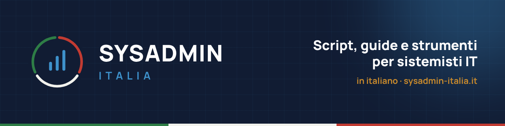

  

Ciao! Sono **Francesco Larossa**, sistemista. Su **[sysadmin-italia.it](https://sysadmin-italia.it)** pubblico in italiano script PowerShell, guide operative e approfondimenti nati da problemi reali di infrastruttura.

### 🔗 Sul sito

| | |
|---|---|
| ⚙️ **[Script gratuiti](https://sysadmin-italia.it/script-gratuiti/)** | 120 script PowerShell pronti da usare, con guida e PDF |
| 📘 **[Guide](https://sysadmin-italia.it/guide/)** | Procedure passo passo su AD, Windows Server, M365, rete, VMware, database |
| 📰 **[Notizie](https://sysadmin-italia.it/notizie/)** | Le novità IT che contano per chi gestisce infrastrutture |
| 👤 **[Chi sono](https://sysadmin-italia.it/chi-sono/)** | Il progetto e chi c'è dietro |

### 📦 Repository

**[sysadmin-italia-scripts](https://github.com/SYSADMIN-Italia/sysadmin-italia-scripts)**: tutti gli script del sito, divisi per categoria, con licenza MIT. Si aggiorna automaticamente ogni settimana.

### 📘 Ultime guide dal sito

<ul>
<!-- BLOG-POST-LIST:START --><li><a href="https://sysadmin-italia.it/come-organizzare-una-libreria-di-script-aziendale-condivisa-e-documentata/">Come organizzare una libreria di script aziendale condivisa e documentata</a></li>
<li><a href="https://sysadmin-italia.it/come-versionare-i-propri-script-con-git/">Come versionare i propri script con Git</a></li>
<li><a href="https://sysadmin-italia.it/come-costruire-un-sistema-di-alert-personalizzato-multi-canale/">Come costruire un sistema di alert personalizzato multi-canale</a></li>
<li><a href="https://sysadmin-italia.it/come-automatizzare-il-rinnovo-di-certificati-ssl-in-scadenza/">Come automatizzare il rinnovo di certificati SSL in scadenza</a></li>
<li><a href="https://sysadmin-italia.it/come-usare-convertto-json-e-convertfrom-json-per-scambiare-dati-tra-sistemi/">Come usare ConvertTo-Json e ConvertFrom-Json per scambiare dati tra sistemi</a></li>
<li><a href="https://sysadmin-italia.it/come-costruire-uno-script-di-onboarding-offboarding-completo/">Come costruire uno script di onboarding/offboarding completo</a></li>
<!-- BLOG-POST-LIST:END -->
</ul>

Elenco aggiornato automaticamente ogni giorno dal feed delle guide del sito.

---

`Active Directory` · `Windows Server` · `PowerShell` · `Microsoft 365` · `Networking` · `VMware ESXi` · `SQL Server` · `Cyber Security`
